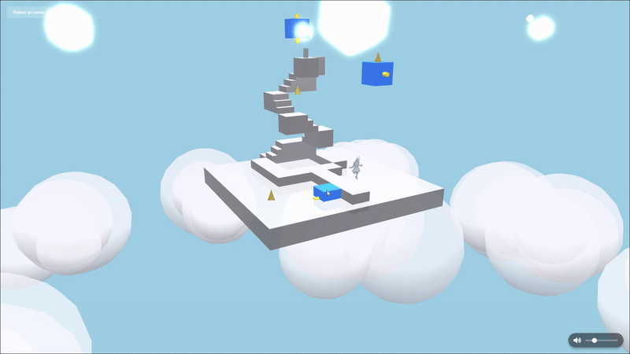
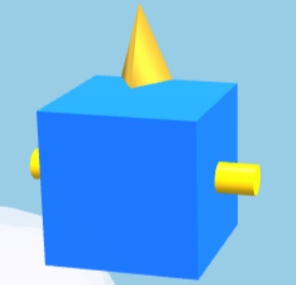

# Dream Travelers

[](https://developer.mozilla.org/fr/docs/Web/Guide/HTML/HTML5)
[](https://developer.mozilla.org/fr/docs/Web/CSS)
[](https://developer.mozilla.org/fr/docs/Web/JavaScript)
[](https://www.babylonjs.com/)

Bienvenue dans **Dream Travelers**, un jeu d'aventure isométrique en 3D développé pour le concours **Games On Web édition 2025**.

Réalisé par : **Jérémy Moncada** étudiant en Licence 3 à MIAGE.

Accès direct au menu du jeu : [Dream Travelers](https://games-on-web.vercel.app/DreamTravelers/index.html)

Découvrez la vidéo complète du gameplay du jeu : [](https://youtu.be/PtZLwr-M_UI) (⚠️ Attention : cette vidéo contient des spoilers sur toutes les énigmes)

Le code du jeu a été ajouté dans ce répertoire GitHub, il a initialement été codé dans un autre dépôt [ici](https://github.com/Ye4hL0w/GamesOnWeb) car il fait partie d'une trilogie de trois jeux. Voici le lien initial pour trouver les trois jeux dont le lore est lié : [Travelers](https://games-on-web.vercel.app/).

## 📖 L'Histoire

Dans la continuité de **Shadow Travelers**, vous avez réussi à récupérer votre corps physique en surmontant de dangereuses épreuves. Vous avez maintenant accès au portail menant à Dream Travelers, mais votre quête n'est pas terminée.

Votre mission est de voyager à travers les rêves et de façonner la réalité. Dream Travelers vous transporte dans un univers onirique où le doute s'installe : suis-je encore éveillé… ou déjà perdu dans un rêve ?

Progressez à travers des niveaux évoluant dans le ciel, où chaque énigme résolue vous entraîne plus profondément dans les méandres du rêve. Collectez d'étranges fragments disséminés à travers des plateformes flottantes et des structures énigmatiques, et percez les mystères d'un monde façonné par l'imagination. Ces fragments sont essentiels pour restaurer complètement vos capacités et réparer le monde fracturé de Dream Land. Chaque niveau représente un nouvel aspect de ce monde onirique qui attend d'être sauvé.

## 🌍 Les Trois Mondes

Dream Travelers propose trois niveaux différents, chacun avec son propre style :

1. **Le Niveau Marin** : Vous êtes sur un bateau au milieu de l'océan. Il faut se déplacer de plateforme en plateforme pour trouver tous les fragments cachés.

2. **Le Niveau dans les Nuages** : On se balade dans le ciel, en allant de nuage en nuage. Il y a pas mal de passages secrets où vous pourrez trouver des fragments.

3. **Le Niveau Spatial** : Pour finir, direction l'espace ! Vous flotterez entre les plateformes pour attraper les derniers fragments. C'est le niveau le plus difficile, les énigmes ont été les plus complexes à réaliser. Assurez-vous de bien observer l'environnement, car certaines plateformes sont cachées. Conseil : utilisez Control + clic de la souris pour déplacer le point de vue et le centrer sur le personnage, ce qui peut aider à mieux visualiser les éléments les plus lointains.

Chaque niveau a ses petites particularités et ses secrets. Vous ne vous ennuierez pas !

## 🕹️ Comment Jouer

1. **Navigation** : Cliquez sur les blocs avec votre souris pour déplacer votre personnage. L'algorithme de pathfinding trouvera automatiquement le chemin. Si un carré rouge apparaît, cela signifie qu'il n'y a pas de plateformes menant à la position souhaitée.


2. **Manipulation d'Objets** : Pour déplacer les plateformes interactives, cliquez sur leurs poignées jaunes. Il existe deux types de plateformes : 
   - **Plateformes Rotatives** : Cliquez sur la poignée pour faire pivoter la plateforme.

   

   - **Sliders** : Maintenez la souris cliquée sur la poignée et déplacez la souris pour faire glisser la plateforme.

   

   Notez que cliquer à côté de la poignée tentera de déplacer le joueur.

3. **Collecte** : Ramassez tous les fragments dispersés dans le niveau.



4. **Objectif** : Atteignez la sortie avec tous les fragments en votre possession pour compléter le niveau.


## 📁 Structure du Projet

```
DreamTravelers/
├── assets/                # Ressources graphiques et audio
│   ├── models/            # Modèles 3D
│   ├── textures/          # Textures et matériaux
│   ├── sounds/            # Sons courts
│   ├── audio/             # Musiques et ambiances
│   └── icon.png           # Icône du jeu
├── js/
│   ├── index.js           # Point d'entrée, gère le menu principal
│   ├── entities/          # Classes des entités du jeu
│   ├── elements/          # Composants interactifs
│   └── levels/            # Configuration des niveaux
├── models/                # Modèles 3D additionnels
├── styles.css             # Styles globaux
├── index.html             # Page d'accueil
├── level1.html            # Niveau du bateau
├── level2.html            # Niveau des nuages
└── level3.html            # Niveau spatial
```

## 🔍 Architecture Technique

### Système de Pathfinding

Le cœur du gameplay repose sur un système de pathfinding sophistiqué implémenté dans la classe `Player` :

- **`findPath(target)`** : Méthode principale qui détermine comment le joueur se déplace d'un point A à un point B.
  - Analyse si le joueur doit monter ou descendre pour atteindre la cible
  - Sélectionne l'algorithme approprié en fonction de la situation
  - Valide les chemins pour éviter les déplacements impossibles
  - Intègre des règles spéciales comme l'utilisation obligatoire des escaliers pour monter

- **`findDescentPath`** : Implémentation d'un algorithme A* adapté qui :
  - Évalue intelligemment les blocs voisins accessibles
  - Accorde une priorité aux escaliers quand nécessaire
  - Prend en compte les plateformes mobiles et rotatives
  - Calcule les coûts de déplacement pour trouver le chemin optimal

- **`moveAlongPath(path)`** : Anime le déplacement du personnage le long du chemin calculé
  - Orchestre la rotation et la translation du modèle 3D
  - Synchronise les animations avec le mouvement
  - Gère les transitions entre les blocs

## 🔧 Installation et Démarrage

1. **Accès direct au jeu déployé** :
   ```
   https://games-on-web.vercel.app/DreamTravelers/index.html
   ```
   Accédez directement au jeu depuis votre navigateur sans installation.

2. **Cloner le dépôt** :
   ```bash
   git clone https://github.com/gamesonweb/dreamland-Ye4hL0w.git
   cd DreamTravelers
   ```
   Ouvrez simplement le fichier `index.html` dans votre navigateur, ou utilisez un serveur web local comme Live Server pour VS Code.

## 📄 Licence

Tous les contenus (images, modèles 3D et sons) utilisés dans ce projet sont libres de droits ou créés spécifiquement pour le projet. Aucune restriction d'utilisation n'est appliquée sur ces ressources.

## 👨‍💻 Crédits

Dream Travelers a été conçu et développé par **Jérémy Moncada**.
